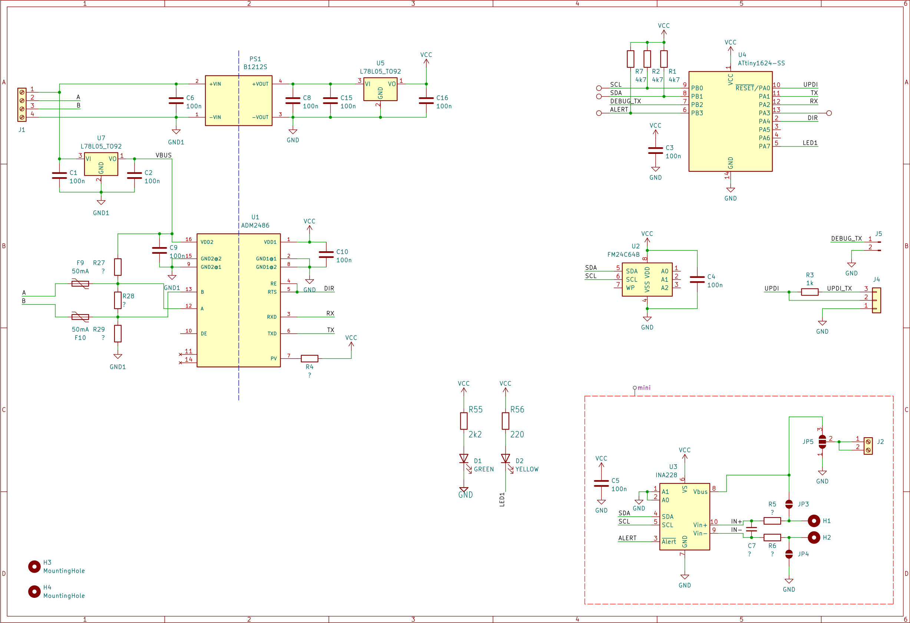
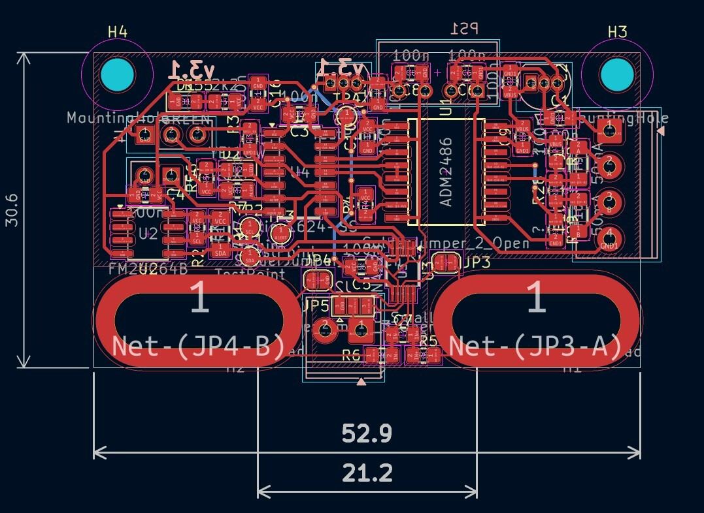
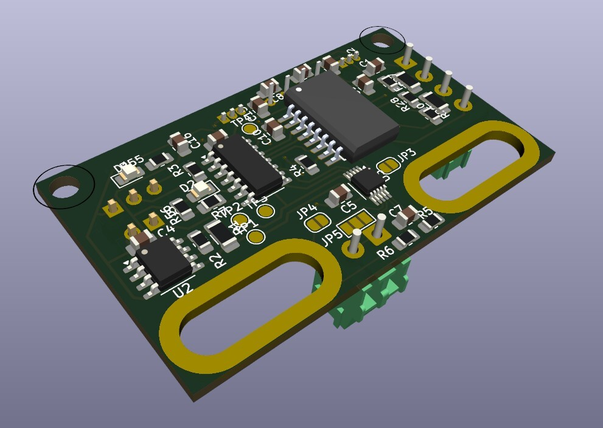
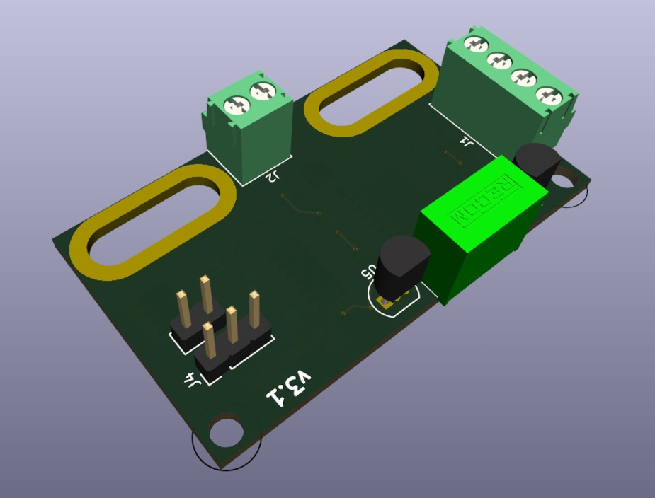
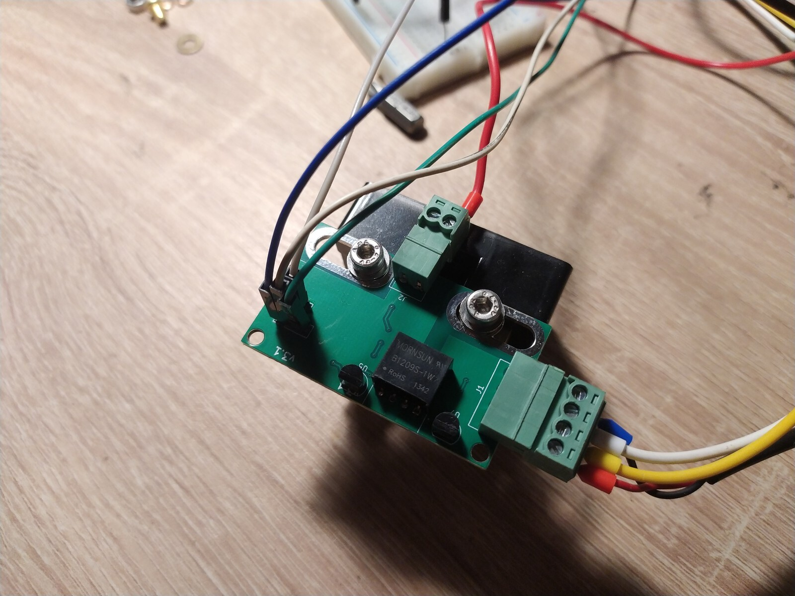
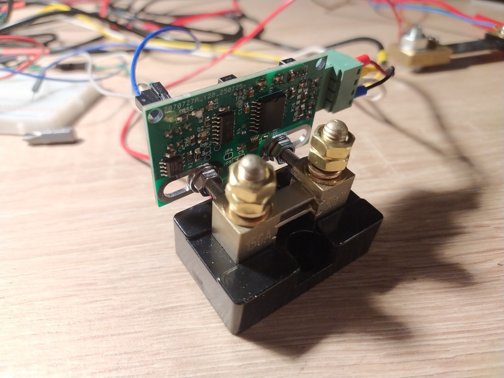

avr-power-meter
======

Device for monitoring bidirectional DC energy usage using various shunt resistors. Designed to mount directly on the shunt.

This version targets 48 V systems (supports up to 85 V on the sensing side).

It is galvanically isolated from the power supply to prevent ground loops.

It communicates via the Modbus RTU protocol over an RS-485 interface.

The core components are the `INA228` sensor and an `ATtiny1626` microcontroller.

### History

See the v1 (test) version in [[v1]](https://github.com/KrystianD/avr-power-meter/tree/v1) branch. \
See the v2 (for 24V systems) version in [[v2]](https://github.com/KrystianD/avr-power-meter/tree/v2) branch.

# Board

 

# Photos

